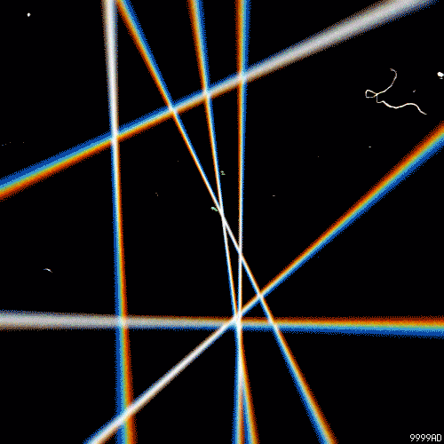

## Reconnaître et tracer des droites perpendiculaires et parallèles

Perpendiculaire et parallèle qu'est-ce que ça veut dire ?

Viens le découvrir avec nous dans ce cours.

[Le cours est disponnible en ligne](https://docs.google.com/presentation/d/1WbpiZd5qau_kbceD-41mvHL3K-O6EGOFsn8gOcmOAYA/edit#slide=id.p)